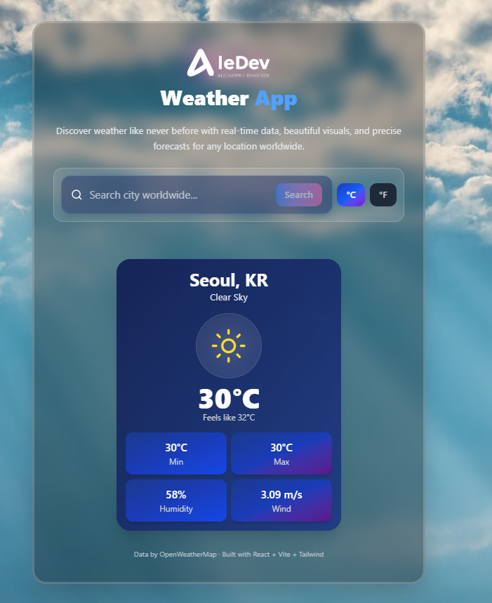

# Weather App by AleDev

Real-time weather for any city worldwide with a modern glassmorphism UI.

**Live demo:** _(add your Vercel URL here after deploy)_
**Portfolio:** https://alejandrocamachodev.vercel.app/

   



## Features
- Search any city worldwide with instant feedback
- Current temperature with °C / °F toggle
- Min / max, humidity and wind speed
- Dynamic weather icons with day / night support
- Friendly error states for unknown cities and network issues
- Responsive layout for mobile and desktop

## Tech stack
- React 19, Vite 7, JavaScript ES6+, Tailwind CSS 4, Lucide React
- OpenWeatherMap Current Weather API
- ESLint, npm

## Run locally

```bash
git clone https://github.com/AlexandroCamacho1000/WeatherAppByAle.git
cd weather-app
npm install
```

Create your env file from the example and add your free API key from https://openweathermap.org/api:

```bash
# Windows
copy .env.example .env
# Mac / Linux
cp .env.example .env
```
```
VITE_WEATHER_API_KEY=your_key_here
```

```bash
npm run dev
# http://localhost:5173
```

```bash
npm run lint
npm run build
npm run preview
```

## Author
Alejandro Camacho — Electronic Engineer & Full Stack Developer
- Portfolio: https://alejandrocamachodev.vercel.app/
- GitHub: https://github.com/AlexandroCamacho1000

---

# Aplicación del Clima por AleDev

Clima en tiempo real para cualquier ciudad del mundo con una interfaz moderna glassmorphism.

**Demo en vivo:** _(agrega tu URL de Vercel aquí después del deploy)_
**Portafolio:** https://alejandrocamachodev.vercel.app/

## Características
- Busca cualquier ciudad del mundo con respuesta inmediata
- Temperatura actual con interruptor °C / °F
- Mínima / máxima, humedad y velocidad del viento
- Iconos dinámicos con soporte día / noche
- Errores amigables para ciudades no encontradas y fallas de red
- Diseño responsive para móvil y escritorio

## Stack tecnológico
- React 19, Vite 7, JavaScript ES6+, Tailwind CSS 4, Lucide React
- API Current Weather de OpenWeatherMap
- ESLint, npm

## Ejecutar localmente

```bash
git clone https://github.com/AlexandroCamacho1000/WeatherAppByAle.git
cd weather-app
npm install
```

Crea tu archivo env desde el ejemplo y agrega tu API key gratuita de https://openweathermap.org/api:

```bash
# Windows
copy .env.example .env
# Mac / Linux
cp .env.example .env
```
```
VITE_WEATHER_API_KEY=tu_key_aqui
```

```bash
npm run dev
# http://localhost:5173
```

```bash
npm run lint
npm run build
npm run preview
```

## Autor
Alejandro Camacho — Ingeniero Electrónico & Full Stack Developer
- Portafolio: https://alejandrocamachodev.vercel.app/
- GitHub: https://github.com/AlexandroCamacho1000
